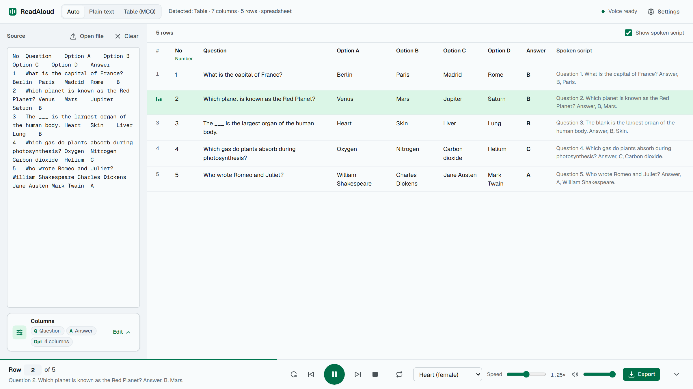
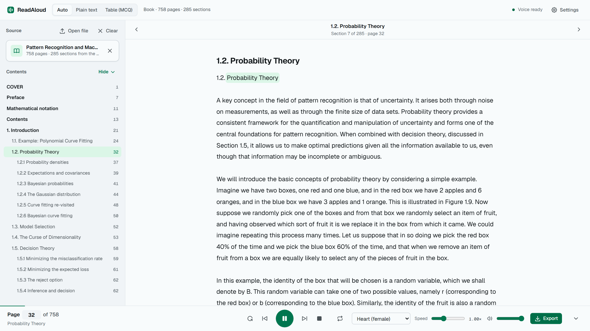
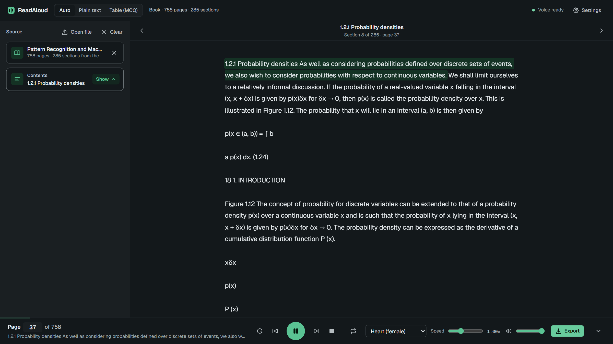

# ReadAloud

ReadAloud reads PDF textbooks and multiple-choice question banks out loud, on your own computer, for free.
The sentence being read is highlighted, so you can follow along.

[](docs/media/readaloud-demo.mp4)

Preview at double speed. [Watch the full 54-second demo](docs/media/readaloud-demo.mp4) (silent).

| Question bank                                                                                     | Textbook                                                                                         | Dark mode                                                                                                  |
| ------------------------------------------------------------------------------------------------- | ------------------------------------------------------------------------------------------------ | ---------------------------------------------------------------------------------------------------------- |
|  |  |  |

## What it does

- **PDF textbooks.** The book's own contents become a clickable list. Jump to any section, or type a page
  number.
- **Question banks.** Paste rows from Excel, Google Sheets, Word, a web page, CSV or Markdown. Each row is
  read as "Question 1. … Answer, B, Paris." Options are skipped unless you turn them on.
- **Any other text**, read sentence by sentence.
- **Remembers your place** when you refresh or reopen the page.
- **Exports audio** as WAV or MP3, or one file per question in a zip.
- **Settings:** 28 voices, speed from 0.5× to 2×, a quiz mode that pauses before each answer, light and
  dark themes.

## Free and private

The voice is [Kokoro-82M](https://huggingface.co/onnx-community/Kokoro-82M-v1.0-ONNX), an open-source model
that runs on your CPU. There's no account or API key, and nothing you load is uploaded. The app listens on
`127.0.0.1` only and works offline after the first run.

It can't be hosted on services like Vercel: the voice model has to stay loaded in a long-running process.

## Set it up

You need [Node.js](https://nodejs.org) 20 or newer.

```bash
npm install
npm start
```

Open <http://localhost:3000>. The first start downloads the voice model (about 330 MB) once.

If port 3000 is taken, run `PORT=3123 npm start` (PowerShell: `$env:PORT=3123; npm start`).

With [Docker](https://www.docker.com/products/docker-desktop/) instead of Node.js:

```bash
docker compose up --build
```

The model is stored in a Docker volume, so it also downloads only once.

## Limits

- Scanned PDFs (no selectable text) can't be read.
- Two-column pages, side boxes and footnotes may be read out of order.

Keys: Space plays and pauses, ← and → move one sentence or row, Shift + ← and → move one section.

Settings, export options and troubleshooting are in the [full guide](docs/GUIDE.md).
